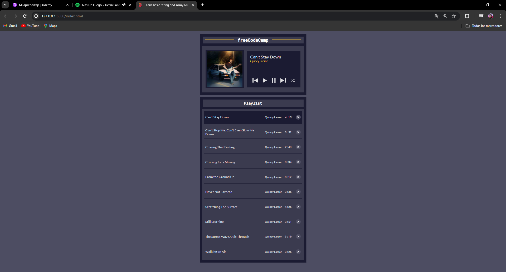

# Music Player App

Este proyecto es un reproductor de música básico construido con HTML, CSS y JavaScript. Permite a los usuarios reproducir, pausar, cambiar de pista y activar el modo aleatorio para una lista de reproducción de canciones.

## Características

- Reproducción y pausa de canciones
- Navegación a la pista siguiente y anterior
- Reproducción aleatoria de canciones
- Visualización de la carátula del álbum, título de la canción y artista
- Lista de reproducción interactiva

## Tecnologías Utilizadas

- HTML
- CSS
- JavaScript

## Instalación

1. Clona este repositorio o descarga el código.
2. Abre el archivo `index.html` en tu navegador web.

## Contribuciones

¡Las contribuciones son bienvenidas! Si deseas mejorar el juego, siéntete libre de crear una solicitud de extracción.

## Créditos

Este juego fue desarrollado por [@Efrasss](https://github.com/efrasss?tab=repositories).

## Licencia

Este proyecto está bajo la Licencia MIT - ver el archivo [LICENSE.md](LICENSE.md) para más detalles.

